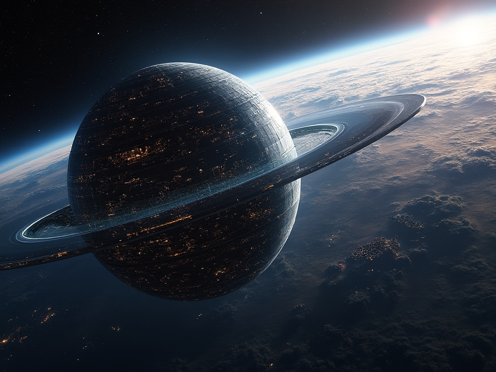

# The Signal Beyond The Stars (MDX)

In the year 2473, humanity had long since spread beyond Earth, colonizing planets and moons in distant star systems. Amidst this interstellar expansion, the **ISV Nomad**, a lone exploratory vessel, drifted through the vast void of space, its mission: to investigate the unknown regions at the edge of the Milky Way.

**Captain Elena Vyasa** sat in the command chair, staring out at the endless sea of stars. It had been six months since the Nomad had left the last human outpost, and nothing unusual had happened—until today.

_"Captain, we're picking up something strange,"_ said **Ensign Niro**, his voice shaky with disbelief.

---

Elena turned her gaze to the monitor, where a faint but distinct signal pulsed. It was unlike anything they had encountered before. Most signals in space were random, cosmic background noise or natural emissions from distant stars. But this one... this one was structured, repeating in a pattern that resembled an ancient code, yet incomprehensible to their computers.

_"Is it artificial?"_ Elena asked, leaning closer to the screen.

_"It has to be. It's too regular, too organized to be natural,"_ Niro replied, his fingers dancing across the console. _"But I can't trace its origin. It's like it's... everywhere and nowhere at once."_

**Dr. Riya Morales**, the ship's xenolinguist, was quickly summoned. She studied the signal for hours, running it through every known translation algorithm. The crew grew restless, their imaginations running wild with the possibility of first contact. Humanity had always dreamed of encountering extraterrestrial intelligence, but never had they come this close.

_"Captain, I think I've found something,"_ Dr. Morales said finally, her voice trembling with a mix of fear and excitement. _"The signal... it's not a message exactly. It's more like... a key."_

_"A key to what?"_ Elena asked, her brow furrowing.

Dr. Morales hesitated. _"I believe it's unlocking something in the space-time continuum, a doorway of sorts. But it's not just any door—it’s ancient. Far older than our civilization, maybe even older than our galaxy."_

As she spoke, the ship's systems flickered, and the lights dimmed. The crew exchanged nervous glances. Then, without warning, the Nomad was engulfed in a blinding white light.

When the light subsided, they were no longer in familiar space. The stars around them were different—alien and distant. But what truly shocked the crew was the colossal structure that now hovered in front of them, an enormous ring-shaped object, spinning slowly in the void. It was constructed from materials that defied their understanding, shimmering with hues that danced between dimensions.

_"Captain, that signal... it’s coming from inside the ring,"_ Niro said, his voice barely a whisper.

Elena stood, her heart racing. _"Prepare the shuttle. We're going in."_

As the crew approached the ring, the Nomad's scanners were overwhelmed with data—energy readings off the charts, gravitational anomalies, and something else: life signatures, though none of them matched any known lifeform in their database.

The shuttle passed through the ring’s inner boundary, and suddenly, space around them rippled. For a brief moment, the universe seemed to fold in on itself, and when it unfolded, they found themselves in a vast chamber—a construct so massive it dwarfed planets.

At the center of the chamber was a monolithic device, pulsating with energy. Dr. Morales gasped. _"This... this is a machine designed to manipulate the fabric of reality itself. Whoever built this—"_

_"They're still here,"_ interrupted **Lieutenant Kael**, pointing to the shadows. Out of the darkness emerged tall, ethereal beings, their forms constantly shifting between solid and translucent. They communicated not with words, but through thoughts, images, and feelings that flooded the crew's minds.

The beings projected a message—a warning and a gift. The machine was a relic of a forgotten civilization, one that had mastered the art of bending reality. They had used it to explore alternate dimensions, timelines, and realms beyond human understanding. But the cost had been great. Entire worlds had been consumed, lost to the void between realities.

_"We cannot allow this power to fall into the hands of another reckless species,"_ the beings conveyed. _"But you, travelers, have shown restraint. We offer you a choice: take this knowledge and risk your world, or leave and never return."_

Captain Elena Vyasa weighed the decision. The potential to unlock the mysteries of the universe was beyond anything she had ever dreamed. But the danger... it was too great.

_"We choose to leave,"_ she said firmly. _"This power is not ours to wield."_

The beings bowed their heads, and the chamber began to collapse in on itself. The crew raced back to the shuttle, narrowly escaping as the colossal ring folded inwards, disappearing into nothingness.

As they returned to their familiar stars, the signal ceased, and silence once again filled the void. The crew of the **Nomad** had survived an encounter with forces far beyond their understanding.

And though the temptation to seek out such power again would linger in their minds, they knew they had made the right choice—for now, at least.

**End.**
